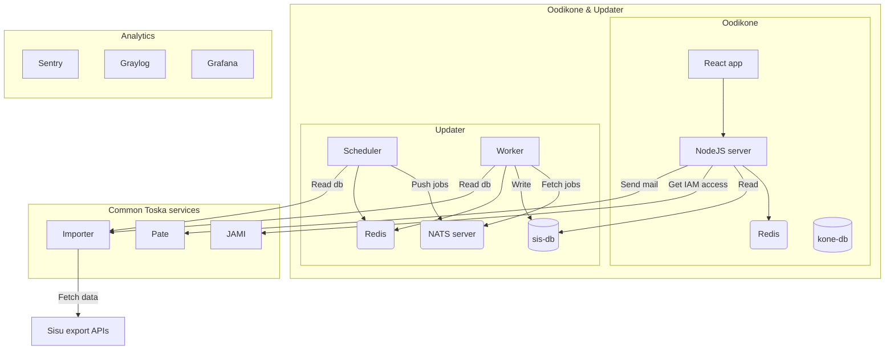

# Oodikone

An application for analyzing university data, running at [https://oodikone.helsinki.fi/](https://oodikone.helsinki.fi/).

## ✔️ Requirements

To run Oodikone locally, you will need the following:

1. Applications:
   - [Docker](https://docs.docker.com/install/) (version 20.10+),
   - [Docker Compose](https://docs.docker.com/compose/install/) (version 1.29+) and
   - [npm](https://docs.npmjs.com/cli/v7) (version 7+)
2. Access to Toska Docker Hub,
3. For real data setup, access to Toskas production servers.
4. For some features to work, access to Toskas service tokens

## 🚀 Installation

Pre-installation steps:

- Clone this repo
- Login to toskas docker hub (see Toskas Gitlab for more information)
- Populate `.env.template` file with correct tokens and rename it to `.env`

Then launch the CLI and follow the instructions:

```bash
npm run cli
```

_Please use a terminal at least 80 characters wide, the CLI is a bit rudimentary_ 😊

What different CLI options do:

1. Set up oodikone from scratch:
   - Cleans up any previous installations
   - Installs all needed npm packages locally
   - Sets up pre-commit linting hooks.
   - Pulls and builds all needed Docker images and sets up dockerized development environment.
   - Setup happens with anonymized data, which developers should use by default.
   - **Note:** Running this option cleans up all real data too, so please don't run option 2 before this.
2. Reset all real data:
   - Cleans up any previous real data databases
   - Downloads needed database dumps from production servers.
   - Creates real data databases and populates them with downloaded dumps.
3. Reset single database
   - Like option 2, but only for single database. Leaves other databases untouched.
4. Restore data from dumps
   - Like option 2, but skips downloading, and simply restores databases from the dumps downloaded earlier.
5. Docker system prune
   - Runs `docker system prune -a && docker volume prune -a`. This will remove all your docker data, also related to any other applications than oodikone! It is sometimes necessary after strange errors due to caching.

## ⌨️ Development

### Architecture



In development, backend and updater use the same redis, but in production they are separate.

See also [older graph](documentation/Oodikone.png), which presents more information.

### Documentation

Folder `documentation` currently contains some notes on sis-db schema and is meant as a place for storing useful information on Oodikone to make life easier for future developers. Feel free to add anything relevant!

### Basics

The development environment is entirely configured in the `docker-compose.yml` file located in this repository. The file defines the services for oodikone's two main components: **oodikone** and **updater**.

Running oodikone with real data requires separated databases and redis, which are defined in `docker-compose.real.yml` file. Otherwise real data development environment uses the configuration as anonymized data development environment.

Some useful commands are defined in `package.json` and can be run with `npm run <command>` as follows:

- `npm run oodikone`: starts oodikone with anonymized data
- `npm run oodikone:real`: starts oodikone with real data
- `npm run updater`: starts updater with anonymized data
- `npm run updater:real`: starts oodikone with real data
- `npm run both`: starts oodikone and updater with anonymized data
- `npm run both:real`: starts oodikone and updater with real data
- `npm run docker:down`: stops the whole environment
- `npm run flushredis`: Clears redis, which forces big calculations to be redone in e.g. studyprogramme overview and faculty views.

Once you have ran setup for oodikone , you can just execute the first one (`npm run oodikone`). After starting and waiting for a while for containers to compile, oodikone can be accessed at [http://localhost:3000/](http://localhost:3000/) and Adminer (database investigation tool) at [http://localhost:5050/](http://localhost:5050/). Adminer requires you to login with username `postgres` and with any password you choose (for example `p`).

### Run.sh script

As said, the development environment runs entirely inside docker containers. To keep `package.json` clean and not filled with predefined scripts, we have created a simple helper script called `./run.sh`. The script allows you to use docker-compose commands without the need to write long list of parameters. Try to run `./run.sh` in the root of the project and see what happens!

`./run.sh` is simply a wrapper script to run oodikone, updater or both services in either anon or real mode. If you take a look at `package.json`, you can see that most of the predefined scripts above use `./run.sh` under the hood.

It is recommended to spend some time to become familiar with `docker` and `docker compose` cli commands. You can then use them directly or with `./run.sh` wrapper. Here is some examples for day-to-day development situations:

- `./run.sh oodikone anon pull`: Pull all images related to oodikone development
- `./run.sh updater real up --build --force-recreate --detach`: Start updater detached (=in the background) in real data mode, but build new images before starting
- `docker compose ps`: view the containers in the running environment
- `docker compose logs frontend`: print logs for just frontend
- `docker compose logs --follow --tail 100 backend`: print last hundred rows of backend logs and begin to follow them in your terminal window
- `docker exec -it backend sh`: open bash terminal inside backend container
- `docker exec -it sis-db psql -U postgres sis-db-real`: open psql client to investigate sis real data database.

### User types for development

By default, you're login as `mluukkai` dev user when running oodikone in development mode. If you want to debug with certain type of user, you can use mocking: go to "Users" -page, click on "edit" on user you want to use and then click icon on the right corner of user card. Another way is to mock user headers - see frontend's api configuration for how this is done.

Anon data contains some preset user types, corresponding to most usual user types in real data. These are used in testing too (see "Testing" below for more info).

### Linting

Cli script sets up pre-commit hooks that are used to lint and fix files before committing. If your `package.json` file doesn't include "lint-staged" -key, please set hooks manually with `npm run prepare`.

For more information on how files are tested, take a look at "lint-staged" in `package.json`. Some files (e.g. github action files, dockerfiles, shell scripts) are checked with external tools and may require you to install those tools in case you're modifying files in question.

Pre-commit hooks will fix auto-fixable problems. To set up quick formatting: In VSCode you can go to command palette, select "ESLint: Fix all auto-fixable problems" and assign a hotkey for it, like `SHIFT + CTRL + '.'`.

## 🔨 Testing & CI

We use cypress for end-to-end testing. No unit tests are currently used.

Cypress

- Can be launched in interactive mode with `npm run cypress open`. `package.json` defines entrypoint `npm run cypress` so you can basically run cypress with any arguments you want
- Are defined in cypress -folder and cypress.config.json
- The entire cypress test stack takes about 15 to 20 mins to run. Since tests are ran in our Github actions CI pipe, you're encouraged to take advantage of this instead of running all tests locally.
- Running tests locally sometimes causes problems after running the whole tests suite due to some login-related issue. Also for this reason, it is usually best practice to only run single views locally, and let the CI run the entire test suite.
- There are some different user types and cypress commands defined for testing. Take a look at these when debugging tests.

Continuous integration (CI) works with Github actions and is defined in workflow files in `.github/workflows` folder:

- Oodikone setup for cypress and other tests in CI is defined in `docker-compose.ci.yml`. Take a look at this too if debugging github action workflows.
- Tests are run on every push
- After a successful test run, oodikone is deployed to staging
- After creating a release, oodikone is deployed to production
- Updater is deployed to production when pushed if tests pass

## ❓FAQ

### Modules are missing after updating package.json

You should always install the dependencies **inside** the container to have the application **inside** the container access them. Module might be missing for example when someone else installs a new library and you only pull the changes in package.json. Use `docker exec <service> npm ci` to install modules inside the container.

### Studyguidance groups don't work on my machine

Make sure you have your VPN on.

### Everything is broken, can't get oodikone running, data is not there etc.

First: Try `npm run cli` option 1: _Set up oodikone from scratch_ and then option 2 to download and restore databases (or option 4 to skip downloading, if you've done it recently).

If that does not help, try option 5: _Docker system prune_. Notice that this clears up **all docker data**, including data related to other projects. If this is not ok, you'll need to identify the oodikone-specific docker volumes yourself and caches and clear those invididually.

## ✌🏼 Maintainers and contribution

[Toska](https://toska.dev) of course.

University of Helsinki

## Tietosuoja / data protection

See [tietosuoja.md](tietosuoja.md).
