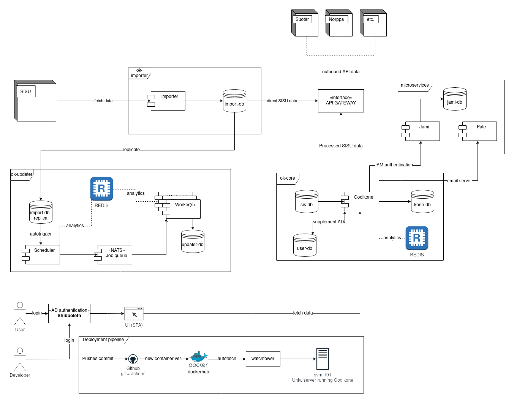

# Oodikone

An application for analyzing university data, running at [https://oodikone.cs.helsinki.fi/](https://oodikone.cs.helsinki.fi/).

## ✔️ Requirements

To run Oodikone locally, you will need the following:

1. Applications:
   - [Docker](https://docs.docker.com/install/) (version 20.10+),
   - [Docker Compose](https://docs.docker.com/compose/install/)(version 1.29+) and
   - [npm](https://docs.npmjs.com/cli/v7) (version 7+)
2. Access to Toska Docker Hub,
3. For real data setup, access to Toskas production servers.
4. For some features to work, access to Toskas service tokens

## 🚀 Installation

Pre-installation steps:

- Clone this repo
- Login to toskas docker hub (see Toskas Gitlab for more information)
- Populate `.env.template` file with correct tokens and rename it to `.env`

Then launch the CLI and follow the instructions:

```bash
npm run cli
```

_Please use a terminal at least 80 characters wide, the CLI is a bit rudimentary_ 😊

What different CLI options do:

1. Set up oodikone from scratch:
   - Cleans up any previous installations
   - Installs all needed npm packages locally
   - Sets up pre-commit linting hooks.
   - Pulls and builds all needed Docker images and sets up dockerized development environment.
   - Setup happens with anonymized data, which developers should use by default.
   - **Note:** Running this option cleans up all real data too, so please don't run option 2 before this.
2. Reset all real data:
   - Cleans up any previous real data databases
   - Downloads needed database dumps from production servers.
   - Creates real data databases and populates them with downloaded dumps.
3. Reset single database
   - Like option 2, but only for single database. Leaves other databases untouched.

## ⌨️ Development

### Architecture



### Documentation

Folder `documentation` currently contains some notes on sis-db schema and is meant as a place for storing useful information on Oodikone to make life easier for future developers. Feel free to add anything relevant!

### Basics

The development environment is entirely configured in the `docker-compose.yml` file located in this repository. The file defines the services for oodikone's two main components: **oodikone** and **updater**.

Running oodikone with real data requires separated databases and redis, which are defined in `docker-compose.real.yml` file. Otherwise real data development environment uses the configuration as anonymized data development environment.

Some useful commands are defined in `package.json` and can be run with `npm run <command>` as follows:

- `npm run oodikone`: starts oodikone with anonymized data
- `npm run oodikone:real`: starts oodikone with real data
- `npm run updater`: starts updater with anonymized data
- `npm run updater:real`: starts oodikone with real data
- `npm run both`: starts oodikone and updater with anonymized data
- `npm run both:real`: starts oodikone and updater with real data
- `npm run docker:down`: stops the whole environment

Once you have ran setup for oodikone , you can just execute the first one (`npm run oodikone`). After starting and waiting for a while for containers to compile, oodikone can be accessed at [http://localhost:3000/](http://localhost:3000/) and Adminer (database investigation tool) at [http://localhost:5050/](http://localhost:5050/). Adminer requires you to login with username `postgres` and with any password you choose (for example `p`).

### Run.sh script

As said, the development environment runs entirely inside docker containers. To keep `package.json` clean and not filled with predefined scripts, we have created a simple helper script called `./run.sh`. The script allows you to use docker-compose commands without the need to write long list of parameters. Try to run `./run.sh` in the root of the project and see what happens!

`./run.sh` is simply a wrapper script to run oodikone, updater or both services in either anon or real mode. If you take a look at `package.json`, you can see that most of the predefined scripts above use `./run.sh` under the hood.

It is recommended to spend some time to become familiar with `docker` and `docker-compose` cli commands. You can then use them directly or with `./run.sh` wrapper. Here is some examples for day-to-day development situations:

- `./run.sh oodikone anon pull`: Pull all images related to oodikone development
- `./run.sh updater real up --build --force-recreate --detach`: Start updater detached (=in the background) in real data mode, but build new images before starting
- `docker-compose ps`: view the containers in the running environment
- `docker-compose logs frontend`: print logs for just frontend
- `docker-compose logs --follow --tail 100 backend`: print last hundred rows of backend logs and begin to follow them in your terminal window
- `docker exec -it backend sh`: open bash terminal inside backend container
- `docker exec -it sis-db psql -U postgres sis-db-real`: open psql client to investigate sis real data database.

### User types for development

By default, you're login as `mluukkai` dev user when running oodikone in development mode. If you want to debug with certain type of user, you can use mocking: go to "Users" -page, click on "edit" on user you want to use and then click icon on the right corner of user card. Another way is to mock user headers - see frontend's api configuration for how this is done.

Anon data contains some preset user types, corresponding to most usual user types in real data. These are used in testing too (see "Testing" below for more info).

### Linting

Cli script sets up pre-commit hooks that are used to lint and fix files before committing. If your `package.json` file doesn't include "lint-staged" -key, please set hooks manually with `npm run prepare`.

For more information on how files are tested, take a look at "lint-staged" in `package.json`. Some files (e.g. github action files, dockerfiles, shell scripts) are checked with external tools and may require you to install those tools in case you're modifying files in question.

There's no separate "lintfix" / "format" / "lint" command available, since pre-commit hooks will fix formatting and basic linting errors for you. In case pre-commit fails, you should fix the erroring code manually.

However, if you want to run linting / formatting manually from command line, `package.json` defines `npm run eslint`, `npm run prettier` and `npm run stylelint` which you can use as an entrypoint.

## 🔨 Testing & CI

There are three types of tests in this project: static tests with eslint/prettier/other tools, jest integration tests for single service and cypress end-to-end tests. Linting is described above and other do work as follows:

- Cypress
  - can be launched in interactive mode with `npm run cypress open`. `package.json` defines entrypoint `npm run cypress` so you can basically run cypress with any arguments you want
  - are defined in cypress -folder and cypress.config.json
  - whole cypress test stack takes about 15 to 20 mins to run. Since tests are ran in our Github actions CI pipe, you're encouraged to take advantage of this instead of running all tests locally.
  - There are some different user types and cypress commands defined for testing. Take a look at these when debugging tests.
- Jest
  - are ran with `docker-compose.test.yml`
  - test command and environment themselves are in Dockerfile for service in question
  - can be debugged by overriding default command in `docker-compose.test.yml` and running docker container in interactive mode

Continuous integration (CI) works with Github actions and is defined in workflow files in `.github/workflows` folder:

- oodikone setup for cypress and other tests in CI is defined in `docker-compose.ci.yml`. Take a look at this too if debugging github action workflows.
- tests are run on every push.
- after successful test run, oodikone is deployed to staging
- after creating a release, oodikone is deployed to production
- updater is deployed to production on every push, no tests included

## ❓FAQ

### Modules are missing after updating package.json

You should always install the dependencies **inside** the container to have the application **inside** the container access them. Module might be missing for example when someone else installs a new library and you only pull the changes in package.json. Use `docker exec <service> npm ci` to install modules inside the container.

### I get the "You are not authorized to use Oodikone" -message when I try to work with anon-data

Make sure you have your VPN on

### I made a change to sis-db models aand created a migration, but tests are failing in CI!

Migrations are handled by sis-importer-worker, since oodikone is using only replica. Since CI is testing only services included in oodikone, your new changes aren't migrated and thus are failing. Open anonyymioodi-folder in this repo to find more about how to to update the anon sis-db.

### Everything is broken, can't get oodikone running, data is not there etc.

Just do clean install by launching cli with `npm cli` and running option 1: _Set up oodikone from scratch_.

## ✌🏼 Maintainers and contribution

Toska of course.

University of Helsinki

## Tietosuoja / data protection

See [tietosuoja.md](tietosuoja.md).
