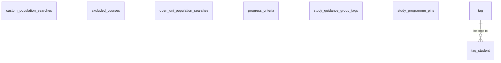
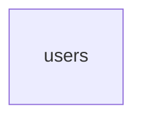

# Databases

Oodikone uses three separate databases, each for different purposes. This document contains a simplified overview of each database and the relations between models.

Use Adminer or refer to the actual database for a detailed view of each model and their attributes.

## sis-db

The `sis-db` database contains information originating from Sisu.

_To be documented._

## kone-db

The `kone-db` database contains information used in various features of Oodikone. This functionality is native to Oodikone and not necessarily directly related to Sisu.

## user-db

The `user-db` database contains information about users of Oodikone.

