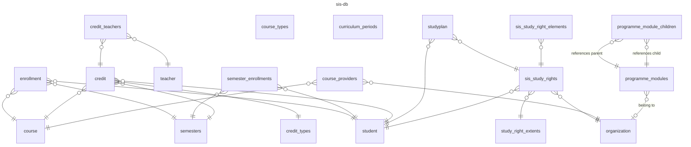
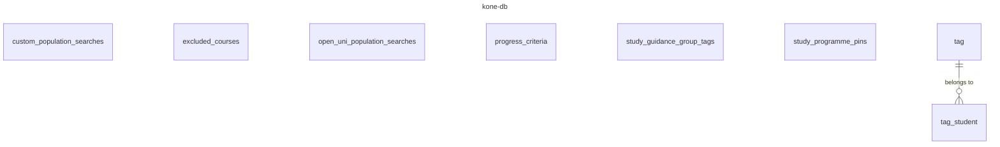
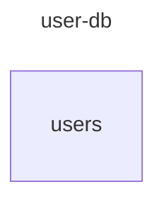

# Databases

Oodikone uses three main PostgreSQL databases, each for a different purpose. This document contains a simplified overview of each database and the relations between models.

Use Adminer or refer to the actual database for a detailed view of each model and their attributes.

## Storage

### sis-db

The `sis-db` database contains information originating from Sisu.

### kone-db

The `kone-db` database contains information used in various features of Oodikone. This functionality is native to Oodikone and not necessarily directly related to Sisu.

### user-db

The `user-db` database contains information about users of Oodikone.

## Caching

### Redis

Redis is used in the backend to cache calculation results.
