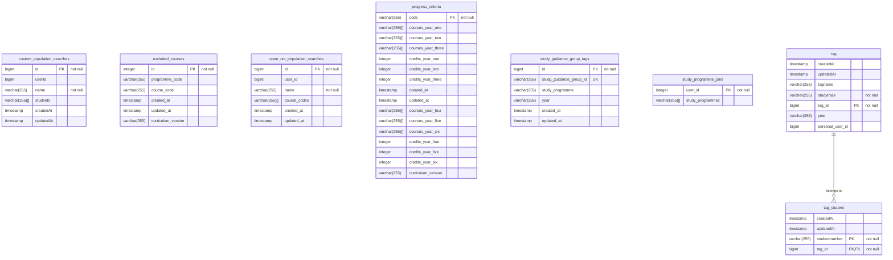
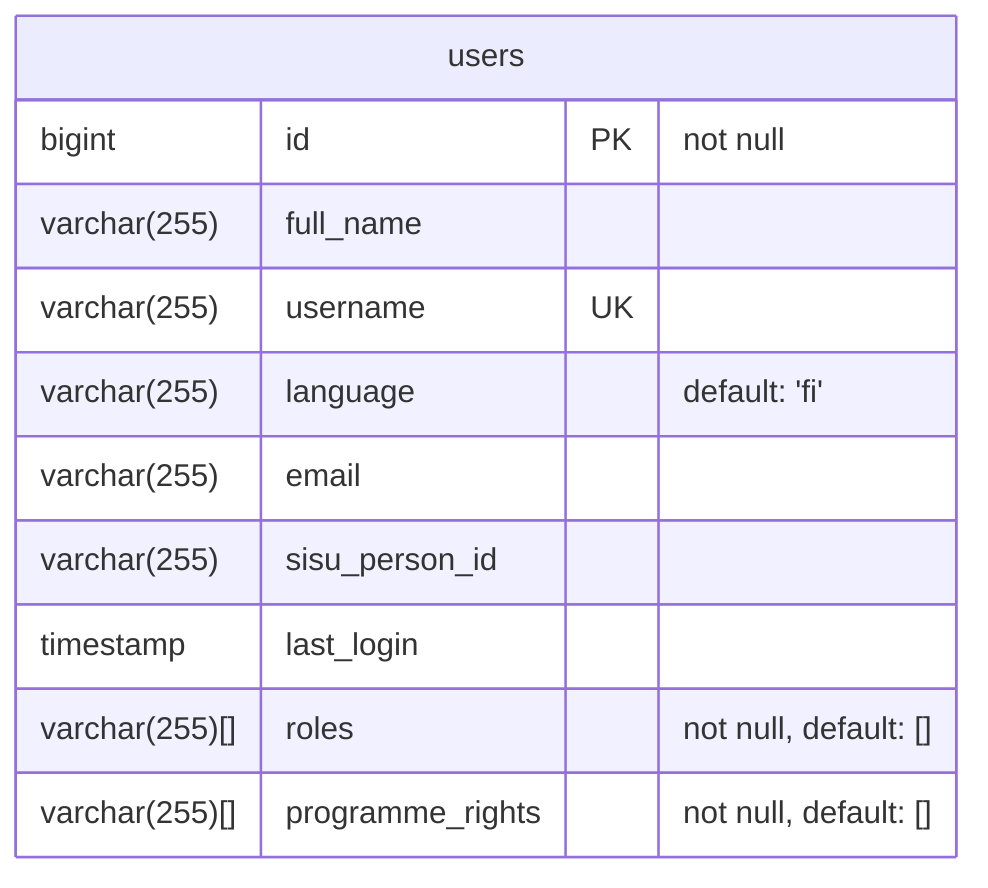

# Databases

Oodikone uses three separate databases, each for different purposes. This document contains a simplified overview of each database.

Please note that each database may contain additional information such as migration tables or indices that are not depicted here. For more details, inspect the actual databases via the commandline.

In the tables, `PK` marks primary key(s), `FK` marks foreign keys and `UK` mark unique keys. Refer to the official [Mermaid.js documentation](https://mermaid.js.org/syntax/entityRelationshipDiagram.html) for full syntax.

## kone-db

The `kone-db` database contains information used in various features of Oodikone. This functionality is native to Oodikone and not necessarily directly related to Sisu.

## user-db

The `user-db` database contains information about users of Oodikone.

