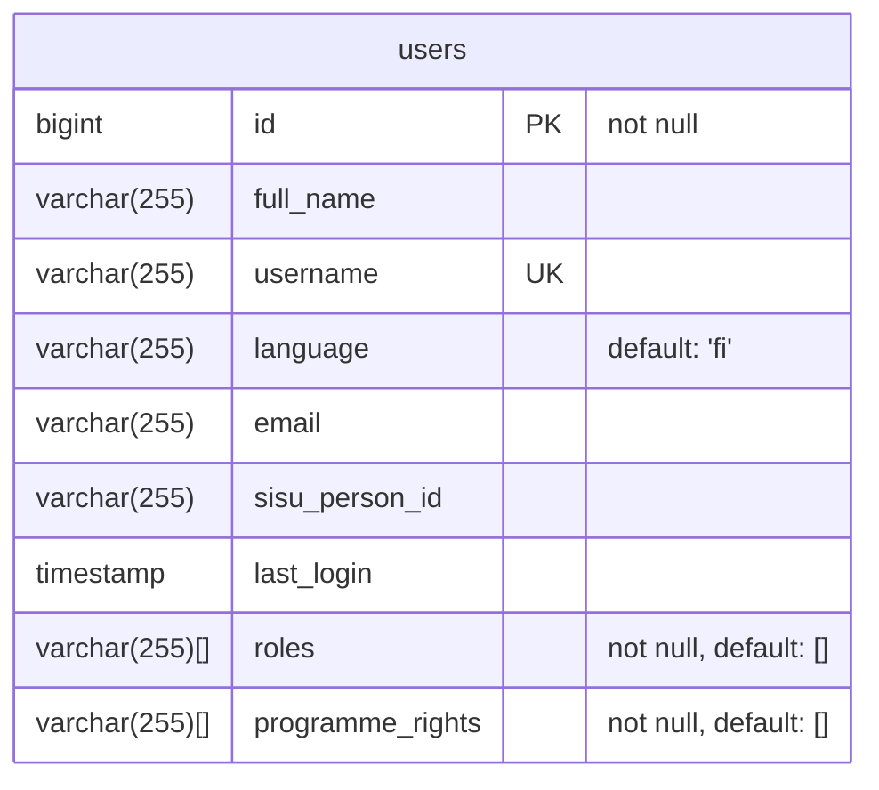

# Databases

Oodikone uses three separate databases, each for different purposes. This document contains a simplified overview of each database.

Please note that each database may contain additional information such as migration tables or indices that are not depicted here. For more details, inspect the actual databases via the commandline.

## user-db

The `user-db` database contains information about users of Oodikone.

